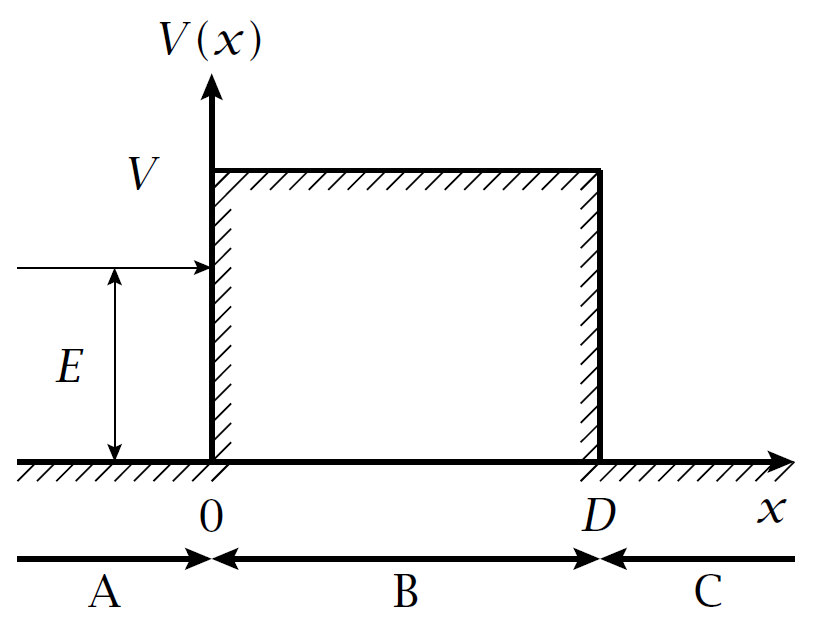

<!-- atomic term symbol -->
\newcommand{\ts}[3]{^{#1}\text{#2}_{#3}}

<!-- \thispagestyle{empty} -->
<!-- \newpage -->

# Mathematische Grundlagen

## Skalarprodukt
* Zweier Vektoren $\va*{y}, \va*{z} \in \mathbb C$: $$\ip{\va*{y}}{\va*{z}} = \sum_{k=1}^{n} y_k^* z_k$$
* Zweier (komplexwertigen) Funktionen $\Psi_1, \Psi_2$: $$\ip{\Psi_1}{\Psi_2} = \int_{-\infty}^{\infty} \Psi_1^* \Psi_2 \dd{x}$$
* Eine komplexe Funktion ist _quadratisch integrierbar_, wenn $\ip{\Psi} < \infty$ gilt.
* Funktionen sind _normiert_ wenn, $\ip{\Psi} = 1$ gilt.
* Zwei Funktionen sind _orthonormiert_, wenn $\ip{\Psi_m}{\Psi_n} = \delta_{mn} = \begin{cases} 1 & n=m \\ 0 & n\neq m \end{cases}$ gilt.

## Operatoren
* Ein Operator $\hat A$ ist eine Rechenvorschrift (Ableitung, Multiplikation etc.), die auf eine Funktion wirkt.
* Der _Kommutator_ zweier Operatoren ist folgendermassen definiert: $$\qty[\hat A, \hat B] = \hat A \hat B - \hat B \hat A = - \qty[\hat B, \hat A]$$
* Für Kommutatoren gelten folgende Rechenregeln:
    * $\qty[\hat A \hat B, \hat C] = \hat A\qty[\hat B, \hat C] + \qty[\hat A, \hat C] \hat B$
    * $\qty[\hat A, \hat B \hat C] =  \qty[\hat A, \hat B] \hat C + \hat B\qty[\hat A, \hat C]$
    * $\qty[\hat A \hat B, \hat C \hat D] = \hat A \qty[\hat B, \hat C] \hat D + \hat A \hat C \qty[\hat B, \hat D] + \qty[\hat A, \hat C] \hat D \hat B +  \hat C \qty[\hat A, \hat D] \hat B$
* Der Kommutator ist selbst ein Operator.

## Matrizen
* Die adjungierte Matrix $A^\dagger$ ist die Transponierte der komplex konjugierten Matrix $A$.
* $A$ ist _selbstadjungiert_, wenn $\qty(A^\dagger)_{ij} = \qty(A)^*_{ji}$ gilt.

# Kapitel 1
nichts

# Kapitel 2: Schrödinger-Gleichung
In der Quantenmechanik werden messbare physikalische Grössen als Obsverablen bezeichnet und durch Operatoren oder Matrizen dargestellt. 

* Ortsoperator $\hat x = x$
* Impulsoperator $\hat p_x = -i\hbar\dv{x}$
* $\qty[\hat x, \hat p_x] = i\hbar$

## Korrespondenzprinzip
Um die Schrödinger-Gleichung eines beliebigen Systems aufzustellen, verwenden wir das folgende Rezept:

1. Die klassische Energie des Systems als Funktion der Ortskoordinaten $(x, y, z)$ und der Impulskoordinaten $(p_x, p_y, p_z)$ ausdrücken.
2. Orts- und Impulskoordinaten durch Orts- und Impulsoperatoren ersetzen, um den _Hamilton-Operator_ $\hat H$ zu erhalten.
3. _Schrödinger-Gleichung_ $\hat H \Psi = E \Psi$ aufstellen.

Nicht die ganze QM kann durch dieses Prinzip hergeleitet werden, da es auch rein quantenmechanische Erscheinungen, wie z.B. den Spin gibt.

## Eine erste Skizze der Quantenmechanik
* In der QM werden Teilchen durch (i. Allg. komplexwertige) Wellenfunktionen dargestellt.
* Messgrössen/Observablen werden durch Operatoren oder Matrizen dargestellt und sind i. Allg. komplexwertig.
* Die experimentellen Messwerte einer Observablen sind die Eigenwerte der Eigenwertgleichung $\hat A \Psi_n = a_n \Psi_n$, wobei $\Psi_n$ eine Eigenfunktion und $a_n$ ein Eigenwert von $\hat A$ ist.

# Kapitel 3: Postulate und Theoreme der Quantenmechanik
\begin{tcolorbox}[enhanced,attach boxed title to top center={yshift=-3mm,yshifttext=-1mm},
  colback=white,colframe=lime!75!black,colbacktitle=lime!75!black,
  title=Postulat 1,fonttitle=\bfseries\sffamily,
  boxed title style={size=small,colframe=lime!75!black} ]
  In der Quantenmechanik wird ein abgeschlossenes System durch seinen Hamilton-Operator $\hat H$ vollständig charakterisiert.
\end{tcolorbox}

* Den Hamilton Operator erhält man gemäss Korrespondenzprinzip.
* Abgeschlossene Systeme sind eine Idealisierung. Messungen sind immer eine Verletzung dieser Isoliertheit.
* Bei der Aufstellung des Hamilton-Operators müssen alle Beiträge berücksichtigt werden, die für die Problemstellung relevant sind.

\begin{tcolorbox}[enhanced,attach boxed title to top center={yshift=-3mm,yshifttext=-1mm},
  colback=white,colframe=lime!75!black,colbacktitle=lime!75!black,
  title=Postulat 2,fonttitle=\bfseries\sffamily,
  boxed title style={size=small,colframe=lime!75!black} ]
  Der Vektorraum der Eigenfunktionen $\varphi_n$ des Hamilton-Operators $\hat H$ ist ein Hilbert-Raum mit Skalarprodukt definiert in Kapitel 1. \\
  Die Gesamtheit aller (i. Allg. komplexen) orthonormalen (d.h. $\braket{m}{n} = \delta_{mn}$) Eigenfunktionen bildet eine Basis des Hilbert-Raums. Jede beliebige Zustandsfunktion $\Psi$ in diesem Raum kann als Linearkombination der Basisfunktionen $\varphi_n$ dargestellt werden. $$\Psi = \sum_n c_n \varphi_n.$$ \\
  Jeder messbaren physikalischen Eigenschaft eines Systems entspricht ein selbstadjungierter, linearer Operator $\hat A$. Dieser physikalischen Eigenschaft kann nur dann ein Wert zugeorndnet werden, wenn der Zustandsvektor $\Psi$ des Systems ein Eigenvektor von $\hat A$ ist, d.h. $\Psi = \varphi_n$ mit $\hat A \varphi_n = a_n \varphi_n$, wobei $a_n$ dann der Wert dieser Eigenschaft ist.
\end{tcolorbox}

* Ist das System im Zustand $\varphi_n$, ergibt eine Messung von $A$ den Wert $a_n$ und das System bleibt unverändert.
* Ist das System eine Superposition $\Psi = \sum_n c_n \varphi_n$, dann entspricht die Messung von $A$ einer immer nicht-deterministischen Projektion von $\Psi$ auf eine Eigenfunktion $\varphi_n$ mit Wahrscheinlichkeit $c_n^* c_n = \abs{c_n}^2$ und ergibt den Wert $a_n$.

\begin{tcolorbox}[enhanced,attach boxed title to top center={yshift=-3mm,yshifttext=-1mm},
  colback=white,colframe=lime!75!black,colbacktitle=lime!75!black,
  title=Postulat 3,fonttitle=\bfseries\sffamily,
  boxed title style={size=small,colframe=lime!75!black} ]
  Der Erwartungswert $\ev{\hat A}_\Psi$ einer Observablen $\hat A$ für ein System mit normierter Zustandsfunktion $\Psi$ ist gegeben durch $$\ev{\hat A}_\Psi = \int \Psi^* \hat A \Psi \dd{\tau}.$$
  Wenn $\Psi$ nicht normiert ist, ist der Erwartungswert gegeben durch $$\ev{\hat A}_\Psi = \dfrac{\int \Psi* \hat A \Psi \dd{\tau}}{\int \Psi^* \Psi \dd{\tau}}.$$
\end{tcolorbox}

* Der Erwartungswert wird interpretiert als arithmetischer Mittelwert der Messwerte von $\hat A$ an einer grossen Anzahl gleichartiger Systeme mit gleicher Zustandsfunktion $\Psi$.
* In der Dirac'schen Bra-Ket-Notation kann man der Erwartungswert schreiben als $\ev{\hat A}_\Psi = \int \Psi^* \hat A \Psi \dd{\tau} = \sum_n \sum_m c_n^* c_m \mel{n}{\hat A}{m} = \sum_n \sum_m c_n^* c_m a_m \ip{n}{m} = \sum_n \abs{c_n}^2 a_n$.

## Matrixdarstellung von Operatoren
Sei $\qty{\varphi_n}$ eine vollständige, orthonormierte Basis von Eigenfunktionen des Operators $\hat A$. $\hat A$ kann äquivalent als Matrix dargestellt werden, wobei für die Elemente der Matrix $$A_{nm} = \int \varphi_n^* \hat A \varphi_m \dd{\tau} = \mel{n}{\hat A}{m}$$ gilt.

\begin{tcolorbox}[enhanced,attach boxed title to top center={yshift=-3mm,yshifttext=-1mm},
  colback=white,colframe=orange,colbacktitle=orange,
  title=Theorem 1,fonttitle=\bfseries\sffamily,
  boxed title style={size=small,colframe=orange} ]
  Selbstadjungierte, lineare Operatoren haben reelle Eigenwerte.
\end{tcolorbox}

* Laut Postulat 2 erhält man bei einer Messung immer einen Eigenwert des Operators. Da diese immer reell sind, müssen quantenmechanische Operatoren demnach selbstadjungiert sein.

\begin{tcolorbox}[enhanced,attach boxed title to top center={yshift=-3mm,yshifttext=-1mm},
  colback=white,colframe=orange,colbacktitle=orange,
  title=Theorem 2,fonttitle=\bfseries\sffamily,
  boxed title style={size=small,colframe=orange} ]
  Eigenfunktionen von selbstadjungierten Operatoren sind orthogonal, wenn sie verschiedene Eigenwerte haben.
\end{tcolorbox}

* Wenn zwei oder mehrere Eigenfunktionen denselben Eigenwert haben, sind sie nicht automatisch orthogonal. Sie können aber immer orthogonal gewählt werden (mit Gram-Schmidt).

\begin{tcolorbox}[enhanced,attach boxed title to top center={yshift=-3mm,yshifttext=-1mm},
  colback=white,colframe=orange,colbacktitle=orange,
  title=Theorem 3,fonttitle=\bfseries\sffamily,
  boxed title style={size=small,colframe=orange} ]
  Wenn zwei Operatoren $\hat A$ und $\hat B$ eine gemeinsame (vollständige) Basis von Eigenfunktionen $\varphi_i$ haben, dann kommutieren die Operatoren.
\end{tcolorbox}

\begin{tcolorbox}[enhanced,attach boxed title to top center={yshift=-3mm,yshifttext=-1mm},
  colback=white,colframe=orange,colbacktitle=orange,
  title=Theorem 4,fonttitle=\bfseries\sffamily,
  boxed title style={size=small,colframe=orange} ]
  Wenn zwei Operatoren kommutieren, dann kann man eine gemeinsame (vollständige) Basis von Eigenfunktionen der beiden Operatoren ermitteln.
\end{tcolorbox}

## Bedingungen für Wellenfunktionen
1. $\Psi$ muss quadratisch integrierbar sein.
  Diese Bedingung gilt nur für gebundene Systeme. Nicht gebundene Systeme (z.B. freies Teilchen) lassen sich nicht einfach normieren.

2. $\Psi$ muss eindeutig definiert sein (single-valued).

3. $\Psi$ muss stetig sein

4. $\dv{\Psi}{x}$ muss differenzierbar sein (also $\Psi$ zweimal diff'bar), und ist im Allgemeinen, aber nicht immer, stetig.

## Heisenbergsche Unbestimmtheitsrelation
Der Operator $\Delta \hat A = \hat A - \ev{\hat A}$ gibt die Abweichung der Messwerte der Observablen $\hat A$ vom Erwartungswert $\ev{\hat A}$ an. Die Streuung (Dispersion) der Messwerte für ein System mit $\Psi$ als Anfangszustand ist somit gegeben durch $$ \sigma_{A, \Psi}^2 = \ev{\qty(\hat A - \ev{\hat A})^2} = \ev{\hat A^2} - \ev{\hat A}^2 = \qty(\Delta A)^2$$
**Wichtig**: Beachte Unterschied zwischen $\Delta\hat A$ und $\Delta A$! $\Delta A = \sqrt{\ev{\hat{A}^2}}$ ist eine Zahl, die als statistische Unbestimmtheit (Streuung) einer Observablen interpretiert werden kann und $\Delta \hat A$ ist ein Operator.

Die **Heisenbergsche Unbestimmtheitsrelation** ist gegeben durch $$ \Delta A \Delta B \geq \dfrac{1}{2} \qty|\ev{\qty[\hat A, \hat B]}|.$$ 

\begin{tcolorbox}[enhanced,attach boxed title to top center={yshift=-3mm,yshifttext=-1mm},
  colback=white,colframe=lime!75!black,colbacktitle=lime!75!black,
  title=Postulat 4,fonttitle=\bfseries\sffamily,
  boxed title style={size=small,colframe=lime!75!black} ]
  Die Zeitevolution eines abgeschlossenen Systems mit zeitunabhängigem Hamilton-Operator wird durch die zeitabhängige Schrödinger-Gleichung beschrieben:
  $$i\hbar\dfrac{\dd{\Psi(q_i,t)}}{\dd{t}} = \hat H \Psi(q_i,t)$$
  wobei $\Psi$ von den Ortskoordinaten und der Zeit abhängt. Ausserdem muss eine Anfangsbedingung $\Psi_0$ gegeben sein.
\end{tcolorbox}

## Erhaltungssätze
* Erhaltungssätze der klassischen Physik sind (mit Anpassungen) auch in der QM gültig.
* In der QM gelten die Erhaltugnssätze nur in Bezug auf Erwartungswerte.
* Hat eine Observable $\hat A$ einen konstanten Erwartungswert (d.h. unabhängig von der Zeitentwicklung des Systems), dann ist sie eine sog. _Erhaltungsgrösse_.
* Die Zeitabhängigkeit des Erwartungswertes von $\hat A$ ist proportional zum Erwartungswert des Kommutators von $\hat A$ und $\hat H$: $$\dv{t} \ev{\hat A} = \dfrac{i}{\hbar} \ev{\qty[\hat H, \hat A]}$$
* **$\hat A$ ist eine Erhaltungsgrösse, wenn $\hat A$ mit $\hat H$ kommutiert.**

### Zusammenfassung Erhaltungsgrössen
Erhaltungsgrössen $\hat A$ $\qty(\Leftrightarrow \qty[\hat A, \hat H] = 0)$ sind besonders wichtig in der QM, weil

* $\hat A$ und $\hat H$ eine gemeinsame Basis vollständige Basis von Eigenfunktionen haben (Thm. 3 & 4)
* stationäre Zustände $\varphi_n$ mit $\hat H \varphi_n = E_n \varphi_n$ einen definierten Wert $a_n$ für die physikalische Grösse $\hat A$ haben (Postulat 3)
* der Erwartungswert $\ev{\hat A}$ bezüglich einer _beliebigen_ Zustandsfunktion $\Psi$ unter der Zeitentwicklung des Systems erhalten bleibt. 

### Bahn-, Spin und Gesamtdrehimpuls

Da der freie Raum isotrop ist, muss der Gesamtdrehimpuls $\vec J$ erhalten bleiben. Experimente zeigen, dass in Atomen der Bahndrehimpuls $\vec L$ nicht erhalten bleibt.

\begin{tcolorbox}[enhanced,attach boxed title to top center={yshift=-3mm,yshifttext=-1mm},
  colback=white,colframe=lime!75!black,colbacktitle=lime!75!black,
  title=Postulat 5,fonttitle=\bfseries\sffamily,
  boxed title style={size=small,colframe=lime!75!black} ]
  Der Spindrehimpuls $\vec{S}$ eines abgeschlossenen Systems ist der Anteil des Gesamtdrehimpulses, der nicht auf einen Bahndrehimpuls zurückzuführen ist: $$\hat{\vec{S}} = \hat{\vec{J}} - \hat{\vec{L}}$$
  Spins kommen in der relativistischen Formulierung der Quantenmechanik vor. Die Existenz des Spins muss aber im Rahmen einer nicht-relativistischen Theorie postuliert werden.
\end{tcolorbox}

### Seperabilität der Schrödinger-Gleichung
Besteht der Hamilton-Operator $\hat H$ eines abgeschlossenen Systems aus zwei oder mehreren Operatoren ($\hat H_a, \hat H_b$), die sich auf separate Variablenräume auswirken, ist die entsprechende Schrödinger-Gleichung separabel. Es gilt: **TODO**
<!-- $$ \hat H \qty(\hat{\vec{p_i}}) $$ -->

## Entartung
Manchmal haben mehrere Lösung der zeitunabhängigen Schrödinger-Gleichung denselben Eigenwert. Man spricht dann von _Entartung_. Dabei gibt der **Entartungsfaktor** $g_i$ an, wie viele Zustände denselben Energieeigenwert $E_i$ haben. 

### Satz über entartete Zustände
Es seien $\varphi_1$ und $\varphi_2$ zwei Eigenfunktionen eines Hamilton-Operators zum selben Eigenwert $E_1 = E_2 = E$. Eine beliebige Linearkombination von $\varphi_1$ und $\varphi_2$ $$\Psi = c_1 \varphi_1 \pm c_2 \varphi_2$$ ist auch eine Eigenfunktion von $\hat H$ zum selben Eigenwert $E$.

# Kapitel 4: Lineare Bewegungen

## Teilchen im 1D Kasten
* $\hat H = -\dfrac{\hbar^2}{2m} \dfrac{\dd^2}{\dd{x}^2} + V(x)$ mit Potential $V(x) = \begin{cases} 0 & \text{falls } 0 \leq x \leq L \\ \infty & \text{sonst.} \end{cases}$
* $E_n = \dfrac{n^2 h^2}{8mL^2}$
* $\Psi_n = \sqrt{\dfrac{2}{L}} \sin(\dfrac{n\pi x}{L})$
* Für $n = 0$ existiert keine Lösung
* Das System hat eine Nullpunktsenergie $E_1 \neq 0$
* Die Anzahl Knoten (Nullstellen von $\Psi_n$) im Intervall $[0, L]$ ist $n-1$ und wächst mit zunehmender Energie.

## Teilchem im 2D/3D Kasten
* $\hat H = -\dfrac{\hbar^2}{2m} \qty(\dfrac{\partial^2}{\partial x^2} + \dfrac{\partial^2}{\partial y^2}) + V(x,y)$ mit Potential $V(x,y) = \begin{cases} 0 & \text{falls } 0 \leq x \leq L_x, 0 \leq y \leq L_y \\ \infty & \text{sonst.} \end{cases}$
* Schrödinger-Gleichung ist gem. Definitionen separabel und kann mit dem Ansatz $\Psi(x,y) = \Psi_{n_x}(x) \Psi_{n_y}(y)$ gelöst werden.
* $E = -\dfrac{h^2}{2m} \qty(\dfrac{1}{\Psi_{n_x}(x)}\dfrac{\partial^2}{\partial x^2}\Psi_{n_x}(x) + \dfrac{1}{\Psi_{n_y}(y)}\dfrac{\partial^2}{\partial y^2}\Psi_{n_y}(y))$
* Das Problem lässt sich also $x$- und $y$-Richtung aufteilen mit 
  * $\Psi_{n_x}(x) = \sqrt{\dfrac{2}{L_x}} \sin(\dfrac{n_x\pi x}{L_x})$
  * $\Psi_{n_y}(y) = \sqrt{\dfrac{2}{L_y}} \sin(\dfrac{n_y\pi y}{L_y})$
* $\Psi_{n_x,n_y}(x,y) = \Psi_{n_x}(x) \Psi_{n_y}(y) = \dfrac{2}{\sqrt{L_x L_y}} \sin(\dfrac{n_x\pi x}{L_x}) \sin(\dfrac{n_y\pi y}{L_y})$
* $E = E_{n_x} + E_{n_y} = \dfrac{h^2n_x^2}{8mL_x^2} + \dfrac{h^2n_y^2}{8mL_y^2} = \dfrac{h^2}{8m} \qty(\dfrac{n_x^2}{L_x^2}+\dfrac{n_y^2}{L_y^2})$
* Die Bewegung des Teilchens in $x$- und $y$-Richtung ist unabhängig voneinander, falls der Raum im Kasten homogen ist.
* **#QZ = #dim**, hier 2: $n_x, n_y$
* Für $L_x = L_y$ gilt $E_{n_x} = E_{n_y} \rightarrow$ es gibt somit eine entartete Lösung.
* Die Ergebnisse lassen sich leicht auf drei Dimensionen erweitern:
  * $E_{n_x,n_y,n_z} = \dfrac{h^2}{8m} \qty(\dfrac{n_x^2}{L_x^2}+\dfrac{n_y^2}{L_y^2}+\dfrac{n_z^2}{L_z^2})$
  * $\Psi_{n_x,n_y,n_z}(x,y,z) = \Psi_{n_x}(x) \Psi_{n_y}(y) \Psi_{n_z}(z) = \sqrt{\dfrac{8}{L_x L_y L_z}} \sin(\dfrac{n_x\pi x}{L_x}) \sin(\dfrac{n_y\pi y}{L_y}) \sin(\dfrac{n_z\pi z}{L_z})$

## Tunneleffekt
Betrachte ein Teilchen mit einem Potential $V$, das eine rechtwinklige Barriere aufweist: $V(x) = \begin{cases} 0 & \text{für } x < 0 \\ V & \text{für } 0 \leq x \leq D \\ 0 & \text{für } x > D \end{cases}$ 

{width=25%} 

Die Schrödinger-Gleichung für das System lautet: $\hat H \Psi(x) = -\dfrac{\hbar^2}{2m} \dfrac{\dd^2}{\dd{x}^2}\Psi + V(x)\Psi$.

**Fall 1**: $D \rightarrow \infty$ (Potentialstufe):

Die Wellenfunktion im Bereich $B$ ist $\Psi_B(x) = A' e^{-\kappa x}$ und die Wahrscheinlichkeitsdichte $\Psi_B^* \Psi_B \dd{x} = A'^2 e^{-2\kappa x}\dd{x}$. Die Wahrscheinlichkeit, das Teilchen im Bereich $B$ vorzufinden nimmt mit zunehmenden $x$ exponentiell ab, es existiert aber trotzdem eine endliche Wahrscheinlichkeit, das Teilchen im klassisch verbotenen Bereich $B$ vorzufinden.

**Fall 2**: $D < \infty$ (Barriere mit endlicher Breite):

**TODO**

**Zusammenfassung**: Die Tunnelwahrscheinlichkeit wird demnach klein für

* breite Barrieren ($D \to \infty$)
* hohe Barrieren ($V \to \infty$)
* grosse Massen $m$ ($\to$ Grenzfall zu kl. Physik)

## Harmonischer Oszillator
  * $\hat H = -\dfrac{\hbar^2}{2m} \dfrac{\dd^2}{\dd{x}^2} + \dfrac{1}{2}kx^2 = -\dfrac{\hbar^2}{2m} \qty[\dfrac{\dd^2}{\dd{x}^2} - \alpha^2 x^2]$ mit $\alpha = \sqrt{\dfrac{mk}{\hbar^2}} = \dfrac{\omega m}{\hbar}$
  * $\Psi(x) = A \exp(-\frac{\alpha x^2}{2}) \underbrace{\sum_{l=0}^\infty c_{2l} x^{2l}}_\text{gerade Fkt.} + B \exp(-\frac{\alpha x^2}{2}) \underbrace{\sum_{l=0}^\infty c_{2l+1} x^{2l+1}}_\text{ungerade Fkt.}$
  * Da der harmonische Oszillator eine Inversionssymmetrie um $x=0$ aufweist, vertauscht der Hamilton-Operator mit dem Paritätsoperator.
  * $\Psi_v(x) = (\alpha / \pi)^{1/4} (2^v v!)^{-1/2} H_v(\sqrt{\alpha}x)e^{-\alpha x^2/2}$ 
  * $E_v = h\nu \qty(v + \frac{1}{2})$
  * **TODO**

## Schwingung zweiatomiger Moleküle

# Kapitel 5: Drehimpulse in der Quantenmechanik
## Der Bahndrehimpuls
Klassisch ist der Bahndrehimpuls eines Teilchens mit Ortsvektor $\vec{r} = (x,y,z)$ und Impulsvektor $\vec{p} = (p_x, p_y, p_z)$ definiert als $\vec{l} = \vec{r} \times \vec{p}$. Gemäss dem Korrespondenzprinzip ist also $$ \hat \vec{l} = \qty(i\hbar \qty(z\pdv{y} - y\pdv{z}), i\hbar \qty(x\pdv{z} - z\pdv{x}), i\hbar \qty(y\pdv{x} - x\pdv{y})) = \qty(\hat l_x, \hat l_y, \hat l_z)$$

Ausserdem gilt $\hat l^2 = \hat l_x^2 + \hat l_y^2 + \hat l_z^2$.

Die folgenden Vertauschungsrelationen gelten:

* $\qty[\hat l_x, \hat l_y] = i\hbar \hat l_z$
* $\qty[\hat l_y, \hat l_z] = i\hbar \hat l_x$
* $\qty[\hat l_z, \hat l_x] = i\hbar \hat l_y$
* $\qty[\hat l^2, \hat l_x] = \qty[\hat l^2, \hat l_y] = \qty[\hat l^2, \hat l_z] = 0$

Daraus folgt:

* Es ist unmöglich, mehr als eine Komponente des Bahndrehimpulsvektors eines Teilchens gleichzeitig exakt zu bestimmen. Es besteht die Unbestimmtheitsrelation $$ \Delta l_x \Delta l_y \geq \frac{1}{2} \qty|\ev{\qty[\hat l_x, \hat l_y]}| = \frac{1}{2} \hbar \qty|\ev{\hat l_z}|.$$
* Der Betrag des Drehimpulsvektors $|\hat\vec l|$ und eine Komponente (z.B. $\hat l_z$) können gleichzeitig genau bestimmt werden.
* Die Operatoren $\hat l^2$ und $\hat l_z$ besitzen eine gemeinsame Basis von Eigenvektoren.

### Drehimpuls in Polarkoordinaten 
**TODO**

### Lösen der Eigenwertgleichungen
Mit dem Ansatz $Y(\theta, \phi) = S(\theta) T(\phi)$ erhalten wir **TODO**

## Allgemeine Drehimpulse
Sei $\hat\vec J = (\hat J_x, \hat J_y, \hat J_z)$ ein allgemeiner Drehimpuls definiert durch die Vertauschungsrelationen

* $\qty[\hat J_x, \hat J_y] = i\hbar \hat J_z$ (zyklische Vertauschung)
* $\qty[\hat J^2, \hat J_x] = \qty[\hat J^2, \hat J_y] = \qty[\hat J^2, \hat J_z] = 0$.

Ein eleganter Weg, die Eigenwertgleichungen zu lösen, wird durch das Definieren der Drehimpuls-_Leiteroperatoren_ $\hat J_\pm$ ermöglicht: $$ \hat J_+ = \hat J_x + i\hat J_y,\hspace{2cm} \hat J_- = \hat J_x - i\hat J_y.$$
Für die Produkt gilt $$\hat J_+ \hat J_- = \hat J^2 - \hat J_z^2 + \hbar \hat J_z \hspace{2cm} \hat J_- \hat J_+ = \hat J^2 - \hat J_z^2 - \hbar \hat J_z$$ und für die Kommutatoren $$\qty[\hat J_+, \hat J_-] = -\hbar \hat J_+ \hspace{2cm} \qty[\hat J_-, \hat J_+] = \hbar \hat J_-$$.

# Kapitel 6: Atome
## Das Wasserstoffatom
* Hamilton-Operator für ein Einelektronenatom mit Kernladung $+Ze$ und Masse $m_K$: $$\hat H = - \dfrac{\hbar^2}{2m_K}\Delta_K - \dfrac{\hbar^2}{2m_e}\Delta_e - \dfrac{Ze^2}{4\pi\epsilon_0 r} + \text{andere Terme}$$ wobei "andere Terme" für bspw. die Spin-Bahn-Kopplung oder Hyperfein-WW stehen.
* Die Lösung hat die (orthonormale) Form $$\Psi_{n,l,m_l}(r,\theta,\phi) = R_{n,l}(r) Y_{l,m_l}(\theta,\phi)$$ $$E_n = -\dfrac{hcRZ^2}{n^2} \ \text{mit } R = R_\infty \dfrac{\mu}{m_e}$$
* Hauptquantenzahl $n = 1,2,3 \dots$, Bahndrehimpulsquantenzahl $l = 0,1,\dots,n-1$ und magnetische Quantenzahl $m_l = -l,\dots,l$
* Energien $E_n$ sind in $l$ und $m_l$ entartet mit Entartungsfaktor $g_n = n^2$
* #Knotenflächen ($\Psi_{n,l,m_l}(\theta,\phi) = 0$) ist $n-1$, davon $n-l-1$ Knotenpunkte in $R_{n,l}$ und $l$ in $Y_{l,m_l}$
* Siehe Anhang D im Skript für die explizite Formen Funktionen von $R_{n,l}$ und $Y_{l,m_l}$
* Wahrscheinlichkeit, ein Elektron im Zustand $\Psi_{n,l,m_l}$ in einem Abstand $r$ vom Kern zu finden, ist $$p_{n,l}(r)\dd{r} = \qty|R_{n,l}|^2 r^2 \dd{r}$$

## Alkalimetallatome
* Können ähnlich behandelt werden, weil sie nur ein Valenzelektron besitzen. Die Stärke der Abschirmung ist von $n$ *und* $l$ abhängig, was zur Aufhebung der Entartung in $l$ führt. Mit dem Quantendefekt $\delta_l$ und der Ionisierungsenergie $E_i$ des Atoms erhält man die **Rydberg-Formel** $$E_{n,l} = E_i - \dfrac{hcR}{(n-\delta_l)^2}$$

## Mehrelektronenatome und Pauli-Prinzip
* **Verallgemeinertes Pauli-Prinzip**: Wellenfunktion ist bei Vertauschung von identischen Fermionen ($s \in (2\mathbb{N}+1)/2$; Elektron, Proton, Neutron etc.) antisymmetrisch bzw. symmetrisch bei Bosonen ($s \in \mathbb{N}$; manche Kerne).
* Konstruktion einer *antisymmetrischen* Funktion: $\Psi(\va{r_1},\va{r_2}) = \frac{1}{\sqrt{2}}(\psi(\va{r_1}, \va{r_2}) - \psi(\va{r_2},\va{r_1}))$
* Konstruktion einer *symmetrischen* Funktion: $\Psi(\va{r_1},\va{r_2}) = \frac{1}{\sqrt{2}}(\psi(\va{r_1}, \va{r_2}) + \psi(\va{r_2},\va{r_1}))$
* Notation: $\ket{nlm_s}$ mit $m_s = 1/2 = \alpha$ und $m_s = -1/2 = \beta$.
* Beispiel: Helium im Grundzustand (1s)$^\text{2}$ ($n=1, l=0=\text{s}$, $s=1/2$): Die Energieeigenfunktionen von Helium sind von der Form $\ket{1si(1)}\ket{1sj(2)}$ mit $i,j=\alpha,\beta$, wobei $(1),(2)$ das jeweilige Elektron bezeichnet. Der Zustand $\alpha\beta$ lässt sich nun schreiben als: $$ \frac{1}{\sqrt{2}} (\ket{1s\alpha(1)}\ket{1s\beta(2)} - \ket{1s\alpha(2)}\ket{1s\beta(1)}) $$
* Bemerke, dass die Kets kommutieren und daher ein $\alpha\alpha$-Zustand 0 ergibt. Daraus folgt das Pauli-Aussschlussprinzip.
* **Pauli-Ausschlussprinzip**: Zwei Elektronen dürfen nicht in allen Quantenzahlen übereinstimmen.
* Antisymmetrische Funktionen können auch mit **Slater-Determinanten** geschrieben werden: 
  \begin{align*} 
    \Psi((1),(2), \dots) = \dfrac{1}{\sqrt{n}} \begin{vmatrix} \psi_1(1) & \psi_2(1) & \dots & \psi_n(1) \\ \psi_1(2) & \psi_2(2) & \dots & \psi_n(2) \\ \vdots & \vdots & \ddots & \vdots \\ \psi_1(n) & \psi_2(n) & \dots & \psi_n(n) \end{vmatrix}
  \end{align*}
* **Aufbauprinzip**: Den Grundzustand eines Mehrelektronensystems erhält man durch Auffüllen der Einelektronenzustände mit steigender Energie, wobei pro Zustand zwei Elektronen mit entgegengesetztem Spin erlaubt sind: 1s < 2s < 2p < 3s < 3p < 4s < 3d < 4p. Allgemein gelten die folgenden empirischen Regeln:
  * $E(n,l) < E(n',l')$, falls $(n+l) < (n'+l')$
  * $E(n,l) < E(n',l')$, falls $(n+l) = (n'+l')$ und $n < n'$

## Konfigurationen, Terme und Termkomponenten
* **LS-Kopplung**: Für leichte Atome, weil Spin-Bahnkopplung < Coulomb-WW
  1. Ermittle Elektronenkonfiguration.
  2. Alle vollbesetzten Schalen weglassen. Falls nur vollbesetzte Schalen vorhanden sind, erhalten wir direkt den einzig möglichen Term: $\ts{1}{S}{0}$.
  3. Alle gemäss Pauli-Prinzip erlaubten Zustände auflisten und zugehörige Werte $M_S = \sum_i m_{s,i}$ und $M_L = \sum_i m_{l,i}$ notieren.
  4. Mit grösstem $(M_L,M_S)$-Paar beginnen. Dieses deutet auf einen Zustand mit $L=M_L$ und $S=M_S$ hin $\Rightarrow$ entsprechenden Term $\ts{2S+1}{L}{J_i}$ notieren, wobei $J_i = L+S, L+S-1, \dots, |L-S|$. Für L $=0,1,3,4,\dots$ schreibt man S, P, D, F, G,...
  5. Nun müssen alle zu diesen Termen gehörenden Paare $(M_L',M_S')$, gegeben durch $M_L' = L,L-1,\dots,-L$ und $M_S'=S,S-1,\dots,-S$ aus der Liste gestrichen werden.
  6. Wiederhole Schritte 4 und 5, bis alle $(M_L,M_S)$-Paare aus der Liste gestrichen sind.
* Nach der Bestimmung aller möglichen Terme muss der *Grundzustandsterm* gefunden werden. Dazu müssen die **Hundschen Regeln** befolgt werden:
  1. Maximiere $S$
  2. Maximiere $L$
  3. Maximiere $J$, falls Schale mehr als halbvoll, sonst minimieren.
* **Trick**: Bei mehr als halbvollen Schalen, können statt den vorhandenen Elektronen auch die fehlenden ("Löcher") betrachtet werden. Die folgenden Konfigurationen haben dieselben möglichen Termsymbole: (2p)$^\text{5} \Leftrightarrow$ (2p)$^\text{1}$, (3d)$^\text{9} \Leftrightarrow$ (3d)$^\text{1}$, (3d)$^\text{8} \Leftrightarrow$ (3d)$^\text{2}$ etc. *Die Bestimmung des Grundzustands kann dabei wegen der 3. Hundschen Regel zu einem anderen Ergebnis führen!*

* **jj-Kopplung**: Für schwere Atome.
  1. Gesamtdrehimpulse der einzelnen Elektronen bestimmen: $j_i = |l_i \pm 1/2|$.
  2. Terme als $(j_1,j_2)_{J_i}$ notieren, wobei $J_i = j_1 + j_2, j_1 + j_2 - 1, \dots, |j_1 - j_2|$ die möglichen Gesamtdrehimpulse des Systems sind.